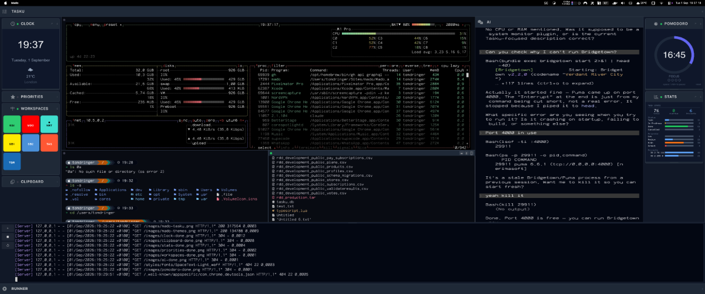
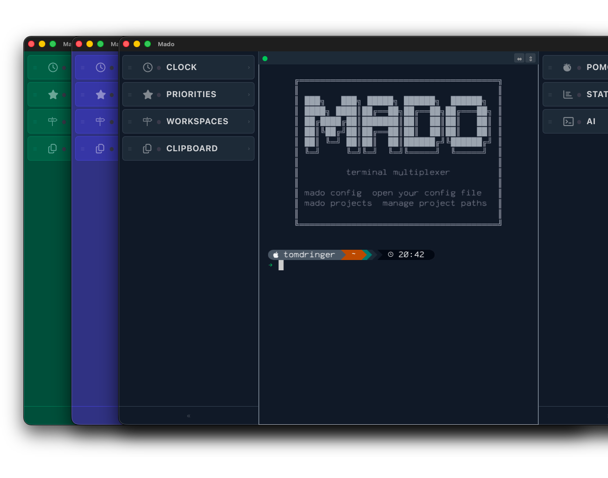
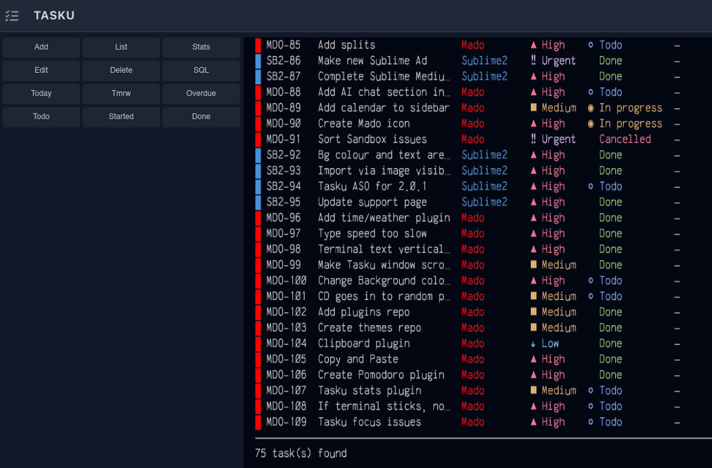

# Mado

A macOS terminal multiplexer with a sidebar plugin architecture, built in Rust.



## Features

- **Pane management** — split terminals horizontally and vertically, tmux-style
- **Sidebar plugins** — left and right sidebars with built-in panels (Clock, Priorities, Workspaces, Clipboard) and support for custom plugins
- **22 themes** — built on Tailwind CSS palettes with Starship integration
- **Workspace persistence** — pane layouts and working directories survive project switches
- **Task management** — integrated [Tasku](https://github.com/nerimasoft/tasku) panel
- **AI panel** — built-in Claude integration
- **Plugin protocol** — build custom sidebar panels using PTY (ANSI/TUI) or pixel (RGBA frame) protocols



## Installation

### Homebrew

```bash
brew tap nerimasoft/mado && brew install --cask mado
```

### Manual

Download `Mado.dmg` from the [latest release](https://github.com/nerimasoft/mado/releases/latest), open it, and drag Mado to your Applications folder.

## Building from source

Requires Rust and a macOS system with Xcode command line tools.

```bash
git clone https://github.com/nerimasoft/mado
cd mado
cargo run
```

## Configuration

Mado is configured via `~/.config/mado/config.toml`. Run `mado config` to open it.

### Projects

Map project codes to paths in `~/.config/mado/projects.toml`:

```toml
[projects.mado]
path = "/Users/you/projects/mado"

[projects.api]
path = "/Users/you/projects/api"
command = "npm run dev"
```

### Themes

Set the active theme in `config.toml`:

```toml
[ui]
theme = "slate"
```

22 built-in themes are available. Drop a custom `.toml` into `~/.config/mado/themes/` to add your own.



## Plugin protocol

Mado supports two plugin rendering modes:

| Mode | Protocol | When to use |
|------|----------|-------------|
| `terminal` | PTY + ANSI escapes | TUI apps, shell scripts |
| `pixel` | RGBA frame protocol | Custom UIs |

See [docs/ecosystem.md](docs/ecosystem.md) for the full protocol specification.

## License

MIT — see [LICENSE](LICENSE).
