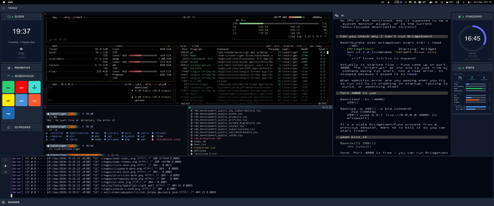
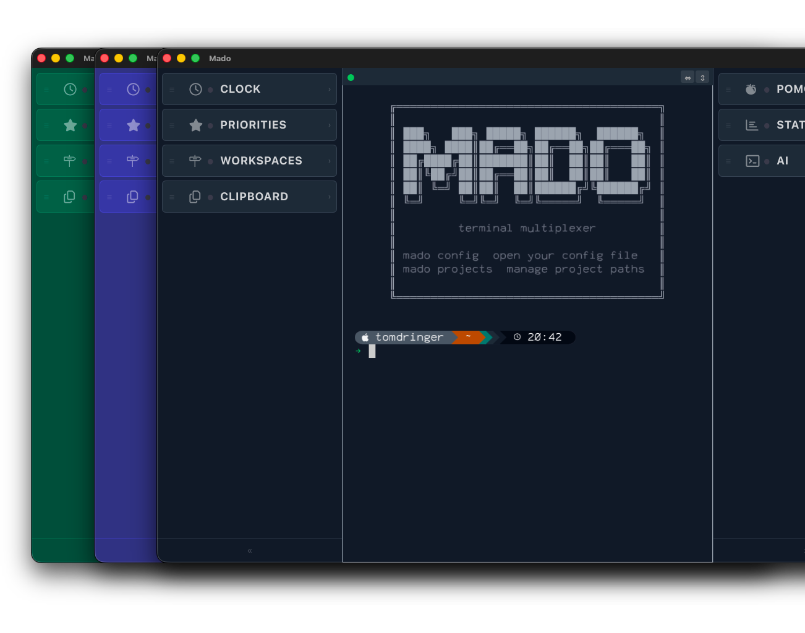
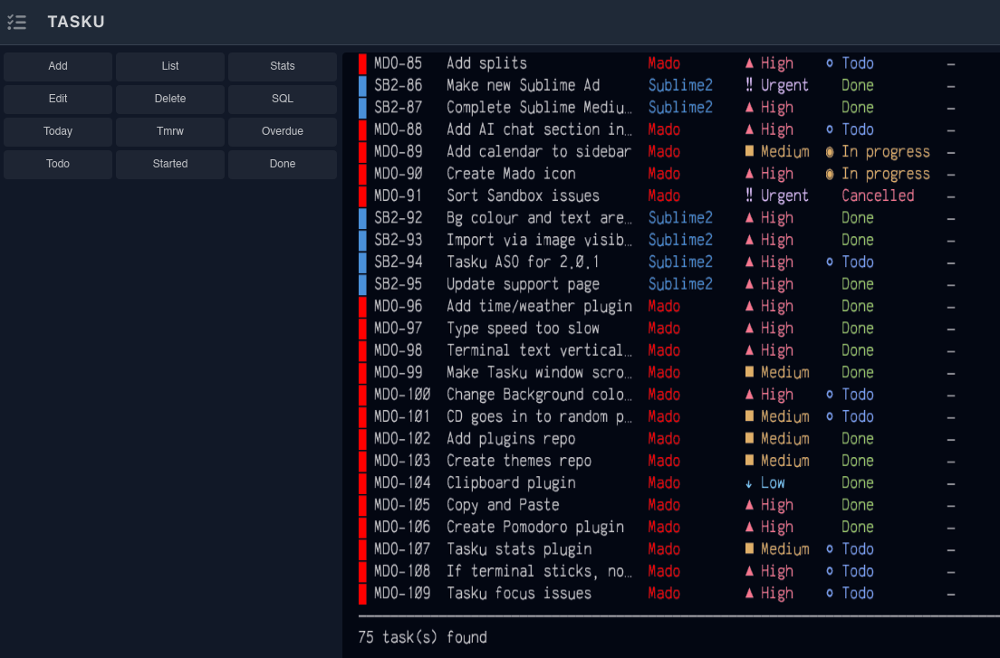

A terminal multiplexer for macOS and Linux with a sidebar plugin architecture, built in Rust.



## Features

- **Pane management** — split terminals horizontally and vertically, tmux-style
- **Sidebar plugins** — left and right sidebars with a growing plugin ecosystem and support for custom plugins
- **22 themes** — built on Tailwind CSS palettes with Starship integration
- **Workspace persistence** — pane layouts and working directories survive project switches
- **Task management** — integrated [Tasku](https://github.com/tomdringer/tasku) panel
- **AI panel** — built-in Claude integration
- **Plugin protocol** — build custom sidebar panels using PTY (ANSI/TUI) or pixel (RGBA frame) protocols



> Screenshots use [Starship](https://starship.rs) for the shell prompt. Mado integrates with Starship automatically if it's installed.

## Installation

### macOS — Homebrew

```bash
brew tap tomdringer/tap
brew install --cask tomdringer/tap/mado
```

To update:

```bash
brew upgrade --cask mado
```

### macOS — Manual

Download `Mado.dmg` from the [latest release](https://github.com/tomdringer/mado/releases/latest), open it, and drag Mado to your Applications folder.

### Linux — Debian / Ubuntu

Download the `.deb` for your architecture from the [latest release](https://github.com/tomdringer/mado/releases/latest):

- `mado_*_amd64.deb` — Intel/AMD (64-bit)
- `mado_*_arm64.deb` — ARM

```bash
sudo dpkg -i mado_*_amd64.deb   # or arm64
```

### Linux — Raw binary

Download the tarball for your architecture from the [latest release](https://github.com/tomdringer/mado/releases/latest):

- `mado-*-linux-x86_64.tar.gz` — Intel/AMD (64-bit)
- `mado-*-linux-aarch64.tar.gz` — ARM

```bash
tar -xzf mado-*-linux-*.tar.gz
cd mado-*-linux-*/
./install.sh
```

Requires `webkit2gtk-4.1` and `gtk3`.

## Building from source

Requires Rust. On macOS, Xcode command line tools are also needed.

```bash
git clone https://github.com/tomdringer/mado
cd mado
cargo run
```

## Configuration

Mado is configured via `~/.config/mado/config.toml`. Run `mado config` to open it. Most settings reload live — no restart needed.

### Projects

Define workspaces in `~/.config/mado/projects.toml`:

```toml
default = "API"

[API]
path   = "~/Projects/my-api"
task   = "cargo run"
deploy = "cargo build --release"

[WEB]
path   = "~/Projects/my-frontend"
task   = "npm run dev"
```

If you use [Tasku](https://github.com/tomdringer/tasku), the workspace code must match your Tasku project name for automatic task filtering.

### Themes

Set the active theme in `config.toml`:

```toml
theme = "slate"
```

22 built-in themes are available. Drop a custom `.toml` into `~/.config/mado/themes/` to add your own.



## Plugins

Community plugins are available at [github.com/tomdringer/mado-plugins](https://github.com/tomdringer/mado-plugins), including Clock, Pomodoro, and more. Install a plugin by adding it to your `config.toml`:

```toml
[[plugins]]
id       = "clock"
command  = "/path/to/mado-clock"
kind     = "pixel"
position = "right"
```

See the [Plugins wiki page](https://github.com/tomdringer/mado/wiki/Plugins) for the full protocol specification.

## License

MIT — see [LICENSE](LICENSE).

## Get in touch

For a quick response, please find me on X - @tomdringer
